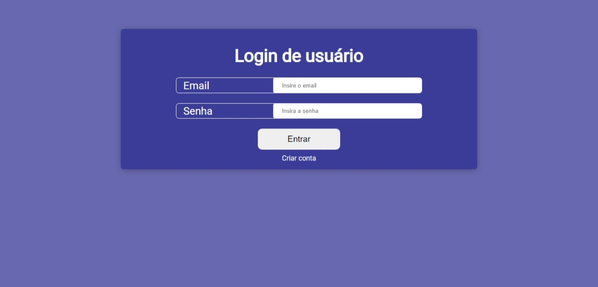
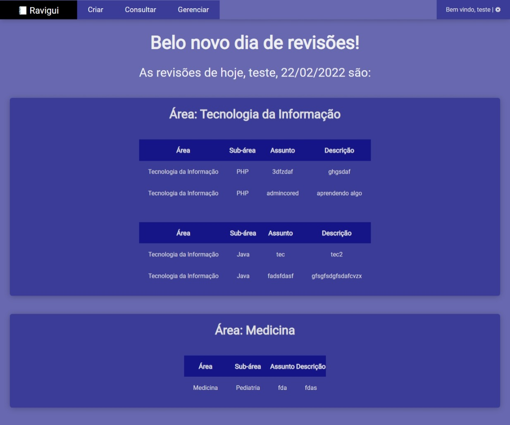
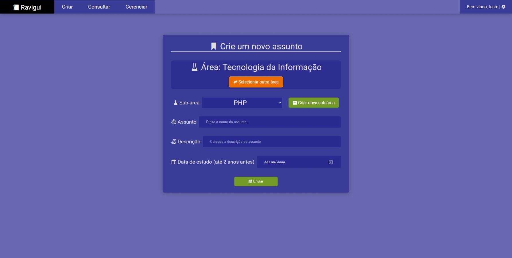
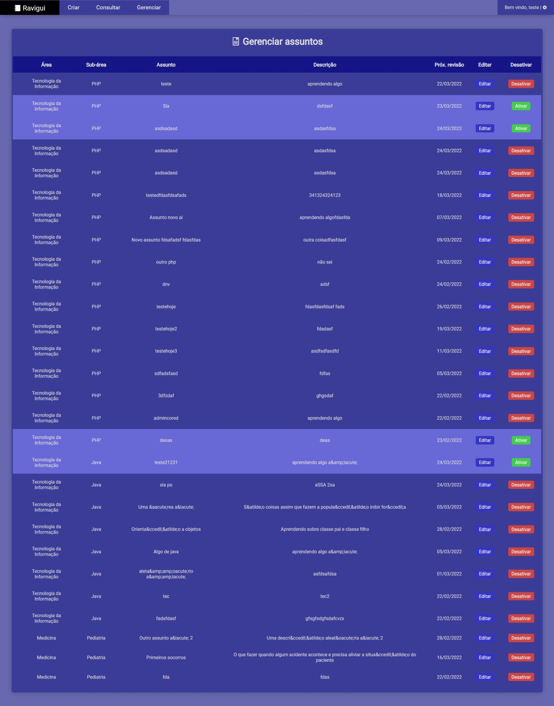

# Sobre

Um programa que gerencia sua revisão. É uma forma de usar ao invés de criar uma planilha manual.

# Como usar

- Abra modelo.mwb em extras/ como modelagem e crie o banco de dados
- Caso queira usuários de teste padrões, abra db.sql em extras/ e execute tal código. A senha de ambos é 123456
- Crie um arquivo env.ini como cópia de env.sample.ini e preencha as configurações. Todas as configurações são em relação ao banco de dados.
- Inicialize o projeto a partir da pasta public

---

# Imagens do sistema

### Login
É possível fazer login ou criar nova conta

---

### Home
As revisões do dia caem na home

---

### Criação de assunto
Criar assunto a partir de uma área e sub-área criadas pelo usuário

---

### Visualizar assuntos
Mostra todos os assuntos criados pelo usuário, podendo editar e desativar ou ativar

